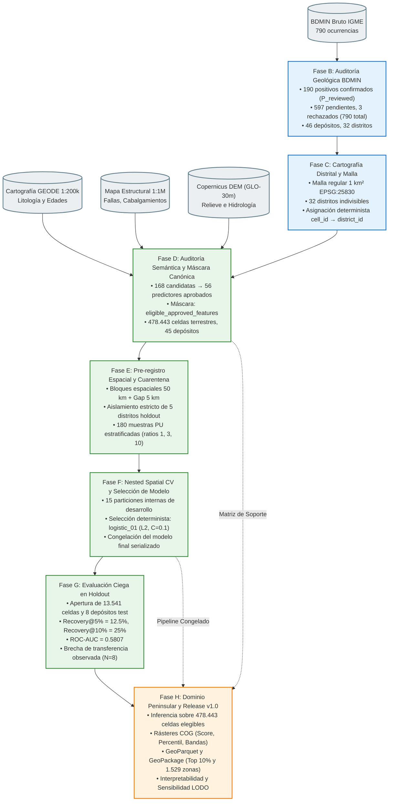

# Trazabilidad Criptográfica y Diagrama de Procedencia B → H (GeoAI-Au v1.0)

El proyecto **GeoAI-Au v1.0** implementa una cadena de suministro de datos e inteligencia artificial (*AI data supply chain*) estrictamente auditable, determinista y sellada mediante funciones hash criptográficas SHA-256 en cada etapa de la cadena de valor científico.

---

## 1. Diagrama de Procedencia Metodológica (Fases B a H)

---

## 2. Registro Canónico de Fases Selladas

Cada ejecución sellada es inmutable y está indexada por su correspondiente `outputs_manifest.json`:

| Fase | Identificador de Ejecución Canónica | Fecha de Sellado | Entregables Principales | Manifiesto y Trazabilidad |
| :---: | :--- | :---: | :--- | :--- |
| **B** | `revision_au_fase_b` | 2026-09-27 | 190 confirmados, 597 pendientes, 3 rechazados (790 total), 46 depósitos, 32 distritos | [`data/review/revision_au_fase_b.csv`](file:///c:/Users/mdmat/Desktop/programacion/GeoAI/data/review/revision_au_fase_b.csv) |
| **C** | `cartografia_distritos` | 2026-09-27 | Delimitación determinista de 32 distritos en malla 1 km | [`data/review/territorial_groups.csv`](file:///c:/Users/mdmat/Desktop/programacion/GeoAI/data/review/territorial_groups.csv) |
| **D** | `reports/fase_d/20260927T135413_959884Z` | 2026-09-27T13:54:13Z | 56 variables aprobadas, soporte `eligible_approved_features` (478.443 celdas, 45 depósitos) | [`outputs_manifest.json`](file:///c:/Users/mdmat/Desktop/programacion/GeoAI/reports/fase_d/20260927T135413_959884Z/outputs_manifest.json) |
| **E** | `reports/fase_e/20260927T135620_576911Z` | 2026-09-27T13:56:20Z | Pre-registro espacial (bloques 50km + gap 5km), cuarentena de 5 distritos holdout, 180 muestras PU | [`outputs_manifest.json`](file:///c:/Users/mdmat/Desktop/programacion/GeoAI/reports/fase_e/20260927T135620_576911Z/outputs_manifest.json) |
| **F** | `reports/fase_f/20260927T135750_819061Z` | 2026-09-27T13:57:50Z | Nested spatial CV (15 particiones internas), selección de `logistic_01`, serialización del modelo | [`outputs_manifest.json`](file:///c:/Users/mdmat/Desktop/programacion/GeoAI/reports/fase_f/20260927T135750_819061Z/outputs_manifest.json) |
| **G** | `reports/fase_g/20260927T141408_460613Z` | 2026-09-27T14:14:08Z | Evaluación ciega inmutable sobre 13.541 celdas y 8 depósitos en 5 distritos de reserva | [`outputs_manifest.json`](file:///c:/Users/mdmat/Desktop/programacion/GeoAI/reports/fase_g/20260927T141408_460613Z/outputs_manifest.json) |
| **H** | `reports/fase_h/20260927T142549_961719Z` | 2026-09-27T14:25:49Z | Dominio peninsular modelado (COG, GeoParquet, GeoPackage), ranking de 1.529 zonas, interpretabilidad y LODO | [`outputs_manifest.json`](file:///c:/Users/mdmat/Desktop/programacion/GeoAI/reports/fase_h/20260927T142549_961719Z/outputs_manifest.json) |

---

## 3. Firmas Criptográficas de Artefactos Críticos

### Modelo Serializado de Producción (Fase F)
- **Ruta**: `reports/fase_f/20260927T135750_819061Z/final_model/final_validated_model.joblib`
- **Algoritmo**: Regresión Logística L2 ($C=0.1$, solver='lbfgs', $P/U=3$) con `StandardScaler`.
- **SHA-256**: `63013b0aef1c7bb5e905ef96472f1092e077a942daffc05fc085600b841d7c35`

### Productos Cartográficos en Dominio Peninsular Modelado (Fase H)
- `maps/mapa_nacional_favorabilidad_score.tif`: `557ff49962e7aa2463e26487e452a8cc3ee9096238b693240224d03da2d56a29`
- `maps/mapa_nacional_favorabilidad_percentil.tif`: `a1b02b5e282cb90b07044dfb2591605330a84d28472ce7b409dd75a409f87455`
- `maps/mapa_nacional_bandas_prioritarias.tif`: `f0f9b5a83a2fb6e95cffc0ce7fdb44cf6055d04581fe4bf4da40398f6d7dd59b`
- `maps/mapa_nacional_prospectividad.geoparquet`: `51d5eb85287f3b89b9d3637e6da373305d259c43d9cbb281816f1c42bf9d2d46`
- `maps/mapa_nacional_prospectividad.gpkg`: `cfa959a4bb387431e78c8c7d0d0f7a08b5e6191ef64c514757c9197c36a439c2`
- `targets/zonas_prospectividad_ranking.csv`: `1297d26c4832be041c2c2eb6fa5b2f27b9c6f2df0e6118b6ec34a04d20914a22`
- `interpretability/coeficientes_estandarizados.csv`: `58189cbb62e6d6aa210214a1a5b81b816223594191c94fcce394c8bdf9689895`
- `interpretability/contribuciones_locales_casos_estudio.csv`: `f003fdb5beae958bf664cc6793e25b449bca7df7b0d71395b21cb320875cfa16`

---

## 4. Política de Inmutabilidad y Gobernanza

1. **Inmutabilidad Post-Evaluación**: Los directorios de las Fases D, E, F, G y H son inmutables y de solo lectura. Ningún archivo contenido en ellos puede ser modificado tras el sellado de Fase H.
2. **Reproducibilidad Determinista**: Cualquier auditor externo puede regenerar las predicciones del dominio peninsular modelado ejecutando el script [`scripts/ejecutar_fase_h_cierre.py`](file:///c:/Users/mdmat/Desktop/programacion/GeoAI/scripts/ejecutar_fase_h_cierre.py) a partir de los datos sellados en D y el modelo congelado en F, obteniendo exactamente los mismos hashes SHA-256.
