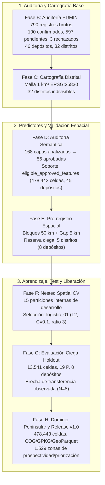

# 🌍 GeoAI-Au v1.0: Sistema Científico de Modelado de Prospectividad Aurífera en España Peninsular

[](CHANGELOG.md)
[](LICENSE)
[](https://epsg.io/25830)
[](https://www.python.org/)
[-brightgreen.svg)](tests/)
[](MODEL_CARD.md)
[](DATA_CARD.md)
[](LIMITATIONS.md)

---

## 📖 Descripción General del Sistema

**GeoAI-Au v1.0** es un sistema reproducible y científicamente auditado de **Mapeo de Prospectividad Mineral (Mineral Prospectivity Mapping - MPM)** enfocado en ocurrencias de **oro (Au)** en España peninsular, implementado sobre una malla regular de soporte territorial de 1 km² en proyección oficial `EPSG:25830`.

El sistema genera índices cuantitativos continuos de favorabilidad geológica relativa (**prospectivity / favorability scores**) y clasificaciones percentilares sobre el dominio peninsular modelado integrando:
1. El **inventario mineral auditado** de la Base de Datos de Yacimientos y Minerales (**BDMIN - IGME**), sometido a un protocolo de revisión geológica exhaustivo.
2. Un conjunto de **56 capas predictoras aprobadas** procedentes de cartografía geológica y estructural oficial del **IGME-CSIC** (1:200.000 y 1:1.000.000) y morfometría de relieve del **Copernicus DEM (GLO-30m) / IGN**.
3. Un protocolo riguroso de **aprendizaje presencia/fondo (PU Learning)** con separación espacial por bloques y evaluación ciega en distritos de reserva (*holdout*).

> [!IMPORTANT]
> **Definición de Salidas del Modelo (Guardarraíl Epistemológico)**:
> - Los valores predichos por el modelo son **prospectivity / favorability scores** (índices relativos de similitud multivariante respecto a las firmas geológicas de los depósitos conocidos de desarrollo) y percentiles acumulados sobre el dominio peninsular modelado.
> - **En ningún caso representan probabilidades estadísticas absolutas de depósito ni probabilidades de presencia física de mineralización**.
> - El modelo no constituye un inventario exhaustivo del territorio nacional, sino una proyección espacial de favorabilidad condicionada estrictamente al **inventario auditado**.
> - Las agrupaciones espaciales continuas se denominan formalmente **zonas de prospectividad/priorización**, rechazando categóricamente el término engañoso de *"yacimientos predichos"*.

---

## 🗺️ Cadena Metodológica Integral B → H

El proyecto se estructura en una secuencia de fases selladas mediante manifiestos criptográficos inmutables con algoritmos de hashing SHA-256:



### Síntesis de Fases Selladas
- **[Fase B](reports/fase_b/)**: Depuración geológica de 790 registros de BDMIN. Identificación de 190 ocurrencias positivas confirmadas (`confirmada`), 597 registros pendientes (`pendiente`) en cuarentena bibliográfica y 3 rechazados (`rechazada`) tras revisión geológica específica (total 790 registros), correspondientes a 46 depósitos independientes y 32 distritos metalogenéticos.
- **[Fase C](reports/fase_c/)**: Delimitación cartográfica determinista cell_id $\rightarrow$ district_id para los 32 distritos sobre la rejilla regular de 1 km² en España peninsular (1.100 $\times$ 910 celdas).
- **[Fase D](reports/fase_d/20260927T135413_959884Z/)**: Auditoría semántica de 168 variables. Exclusión de 112 capas con riesgo de fuga de información o geoquímica discontinua. Aprobación de 56 predictores (litología, edades, estructuras, MDT e hidrología). Máscara `eligible_approved_features` con **478.443 celdas terrestres elegibles** (96,29% del territorio peninsular) y **45 depósitos modelables**.
- **[Fase E](reports/fase_e/20260927T135620_576911Z/)**: Pre-registro de protocolo de validación espacial (bloques de 50 km $\times$ 50 km con buffer de exclusión de 5 km) y aislamiento estricto de 5 distritos de reserva ciega (*Cabo de Gata, Costa da Morte, La Jara/Montes de Toledo, Ossa Morena/Peñaflor y Béticas/Granada*).
- **[Fase F](reports/fase_f/20260927T135750_819061Z/)**: Comparación anidada (*nested spatial CV*, 15 particiones internas) entre Logistic Regression, Random Forest, ExtraTrees y HistGradientBoosting. Selección ciega del pipeline `logistic_01` (Regresión Logística L2, $C=0.1$, ratio $P/U=3$) priorizando recuperación de depósitos independientes al 5% de área territorial (`deposit_recovery@5%`).
- **[Fase G](reports/fase_g/20260927T141408_460613Z/)**: Evaluación ciega e inmutable sobre el holdout (13.541 celdas, 8 depósitos independientes). Recovery@5% = 12,50%, Recovery@10% = 25,00%, ROC-AUC = 0,5807. Caracterización de la **brecha de transferencia observada ($N=8$)**.
- **[Fase H](reports/fase_h/20260927T142549_961719Z/)**: Inferencia sobre las 478.443 celdas elegibles del dominio peninsular modelado, generación de rásteres COG, capas vectoriales GeoPackage y GeoParquet, análisis de interpretabilidad, sensibilidad LODO y delineación de 1.529 zonas contiguas de prospectividad/priorización.

---

## 📦 Productos Cartográficos y Entregables GIS (GeoAI-Au v1.0)

Los entregables finales se encuentran sellados e indexados con manifiesto SHA-256 en [`reports/fase_h/20260927T142549_961719Z/`](reports/fase_h/20260927T142549_961719Z/):

| Formato | Archivo | Especificaciones Técnicas |
| :--- | :--- | :--- |
| **COG Raster** | [`mapa_nacional_favorabilidad_score.tif`](reports/fase_h/20260927T142549_961719Z/maps/mapa_nacional_favorabilidad_score.tif) | Cloud Optimized GeoTIFF (Float32, EPSG:25830, 1 km). Favorability score continuo normalizado (0.0003 a 0.9899) en el dominio peninsular modelado. |
| **COG Raster** | [`mapa_nacional_favorabilidad_percentil.tif`](reports/fase_h/20260927T142549_961719Z/maps/mapa_nacional_favorabilidad_percentil.tif) | Cloud Optimized GeoTIFF (Float32, EPSG:25830, 1 km). Percentil acumulado sobre el dominio peninsular modelado (0% a 100%). |
| **COG Raster** | [`mapa_nacional_bandas_prioritarias.tif`](reports/fase_h/20260927T142549_961719Z/maps/mapa_nacional_bandas_prioritarias.tif) | Cloud Optimized GeoTIFF categórico (Byte, EPSG:25830). 1 = Top 1%, 2 = Top 1-5%, 3 = Top 5-10%, 0 = Fondo. |
| **GeoParquet** | [`mapa_nacional_prospectividad.geoparquet`](reports/fase_h/20260927T142549_961719Z/maps/mapa_nacional_prospectividad.geoparquet) | GeoParquet con las 478.443 celdas terrestres elegibles con geometrías Point (EPSG:25830) y atributos completos. |
| **GeoPackage** | [`mapa_nacional_prospectividad.gpkg`](reports/fase_h/20260927T142549_961719Z/maps/mapa_nacional_prospectividad.gpkg) | Capa `celdas_priorizadas_top10` (47.845 puntos) y capa `zonas_prospectividad` (1.529 polígonos priorizados). |
| **Tabla CSV** | [`zonas_prospectividad_ranking.csv`](reports/fase_h/20260927T142549_961719Z/targets/zonas_prospectividad_ranking.csv) | Ranking de las 1.529 zonas con métricas de área, scores máximos/medios y contexto geográfico. |

### Umbrales Territoriales de Priorización sobre el Dominio Peninsular Modelado
Derivados de la distribución del área terrestre sobre las 478.443 celdas elegibles del inventario:
- **Banda Top 1%**: Score $\ge \mathbf{0,8333}$ (Superficie terrestre: 4.783,7 km²).
- **Banda Top 5%**: Score $\ge \mathbf{0,6526}$ (Superficie acumulada: 23.918,3 km²).
- **Banda Top 10%**: Score $\ge \mathbf{0,5179}$ (Superficie acumulada: 47.837,0 km²).

> [!NOTE]
> **Anotación Post-Hoc de Depósitos Históricos en el Ranking de Zonas**:
> Las columnas de proximidad a depósitos y distritos históricos (`Depósito Histórico Próximo`, `Distrito Asociado`, `Distancia al Depósito (km)`) incluidas en la tabla de zonas son **exclusivamente una anotación geográfica post-hoc** calculada a partir de los centroides de los polígonos vectoriales. **Ningún identificador, etiqueta, distancia a yacimientos conocidos ni metadato de indicios participó en el vector de predictores $X$ ni intervino en la inferencia del modelo.**

---

## 🔍 Interpretabilidad Científica y Signo de Variables

El clasificador lineal regularizado `logistic_01` permite una descomposición analítica directa en escala logit.

> [!TIP]
> **Especificación de Odds Ratio**: $\exp(\beta)$ representa el cambio proporcional en los odds relativos de favorabilidad por cada incremento de **1 desviación estándar ($+1\sigma$) de la covariable continua tras el preprocesamiento con `StandardScaler`**.

### Variables de Mayor Contribución Positiva
1. `edades_u023_fraccion` ($\beta = +0,5962$, Odds Ratio = 1,815 por $+1\sigma$): Rocas del Silúrico-Devónico.
2. `litologia_u019_fraccion` ($\beta = +0,4391$, Odds Ratio = 1,551 por $+1\sigma$): Vulcanitas y rocas volcanoclásticas neógenas (fundamental en Cabo de Gata).
3. `elevacion_media_m` ($\beta = +0,3943$, Odds Ratio = 1,483 por $+1\sigma$): Zócalos y macizos montañosos paleozoicos frente a cuencas sedimentarias.
4. `litologia_u008_fraccion` ($\beta = +0,3817$, Odds Ratio = 1,465 por $+1\sigma$): Cuarcitas, pizarras y areniscas paleozoicas.
5. `litologia_u011_fraccion` ($\beta = +0,3518$, Odds Ratio = 1,422 por $+1\sigma$): Granitoides tardihercínicos de dos micas.

### Significado Riguroso del Signo en Variables de Distancia
| Variable | Coeficiente Estandarizado ($\beta$) | Odds Ratio ($e^\beta$, cambio por $+1\sigma$) | Comportamiento del Modelo | Hipótesis Geológica y Análisis de Datos |
| :--- | :---: | :---: | :--- | :--- |
| `dist_cauce_m` | **-0,4482** | **0,639** | A menor distancia a la red hidrográfica, mayor score. | Depósitos aluviales y valles encajados a lo largo de fallas. |
| `dist_contacto_intrusivo_cartografiada_m` | **-0,1335** | **0,875** | A menor distancia al contacto ígneo, mayor score. | Halos de metamorfismo térmico y skarns peribatolíticos. |
| `dist_cabalgamiento_cartografiada_m` | **-0,0769** | **0,926** | A menor distancia a cabalgamientos, mayor score. | Trampas estructurales compresivas y cizallas dúctiles. |
| `dist_falla_cartografiada_m` | **+0,2122** | **1,236** | A mayor distancia a fallas cartografiadas 1:1M, mayor score. | **Hipótesis estadística y cartográfica (no mecanismo demostrado)**: Se formula como hipótesis que el signo positivo deriva de la colinealidad multivariante en la regresión regularizada L2 cuando conviven otras variables estructurales (cabalgamientos y contactos intrusivos con coeficientes negativos), combinado con posibles artefactos de escala cartográfica (1:1.000.000) y la concentración del muestreo de fondo $U$ en zonas montañosas con densa fracturación cartografiada regional. **Bajo ningún concepto debe interpretarse como un mecanismo físico o metalogenético demostrado** que indique que la mineralización aurífera eluda las fallas. |

### Casos de Estudio: Diagnósticos e Hipótesis
- **Rodalquilar (`dep_rodalquilar_cinto`)**: Score 0,8801 (Percentil 99,65%). El término de vulcanitas (`litologia_u019_fraccion`, $+4,476$ log-odds) reconoce la singularidad del complejo volcánico de Cabo de Gata.
- **La Jara (`dep_la_oriental_la_jara`)**: Score 0,6333 (Percentil 93,07%, Top 7%). Capturado eficazmente gracias a las fracciones metasedimentarias del Proterozoico/Paleozoico.
- **Corcoesto y Santa Comba (`dep_corcoesto`, `dep_santa_comba_zas`)**: Scores ~0,05 (Percentiles ~37–40%). Fuertemente penalizados por la unidad `litologia_u015_fraccion` ("Otros granitoides", $-1,773$ log-odds).
  - *Hipótesis geológica explicativa (no causalidad demostrada)*: Al carecer de geoquímica secundaria aprobada (As, Sb, Bi) o indicadores de alteración hidrotermal a escala fina, el modelo regional no puede discriminar una cizalla granítica mineralizada de un batolito regional estéril.

---

## ⚠️ Limitaciones Estructurales y Brecha de Transferencia

1. **Tamaño Muestral Reducido ($N=45$ depósitos modelables)**: El universo de yacimientos contrastados en el inventario auditado es reducido; entrenar con 37 depósitos y evaluar con 8 impone alta varianza estimativa.
2. **Potencia Estadística en Holdout ($N=8$ depósitos)**: Cada acierto o fallo representa un escalón discreto del 12,5% en la tasa de recuperación.
3. **Brecha de Transferencia Observada ($N=8$)**: El descenso de rendimiento entre desarrollo (ROC-AUC ~0,74) y holdout ciego (ROC-AUC 0,58) refleja que el modelo lineal experimenta dificultad al transferir a distritos geográficamente lejanos con metalogenia contrastada.
4. **Ausencia de Geoquímica Aprobada**: El Atlas Geoquímico disponible fue excluido por falta de cobertura analítica continua, privando al modelo de vectores químicos de dispersión.

Para un análisis exhaustivo, consulte [`LIMITATIONS.md`](LIMITATIONS.md).

---

## 🛠️ Instalación y Verificación

### 1. Clonar el Repositorio y Configurar Entorno
```bash
git clone https://github.com/Mateoaf/GeoAI.git
cd GeoAI

# Crear entorno con Python 3.10+
python -m venv .venv
# En Windows:
.venv\Scripts\activate
# En Linux/macOS:
source .venv/bin/activate

# Instalar dependencias
pip install -e .
```

### 2. Ejecutar la Suite Completa de Tests Unitarios
```bash
pytest tests/ -v
```
*(77 tests unitarios y de integración verifican la consistencia de etiquetas, particiones espaciales, extracción de features, inferencia y evaluación).*

---

## 📚 Documentación Técnica Asociada

- [`MODEL_CARD.md`](MODEL_CARD.md): Ficha técnica formal del modelo `logistic_01` (arquitectura, entrenamiento, evaluación y gobernanza).
- [`DATA_CARD.md`](DATA_CARD.md): Ficha de procedencia y auditoría de datos (BDMIN, cartografía IGME, Copernicus DEM y particiones).
- [`LIMITATIONS.md`](LIMITATIONS.md): Declaración exhaustiva de limitaciones estadísticas, geológicas y epistemológicas.
- [`PROVENANCE_B_H.md`](PROVENANCE_B_H.md): Diagrama de procedencia metodológica y tabla de hashes SHA-256.
- [`CHANGELOG.md`](CHANGELOG.md): Historial de versiones y evolución de la cadena metodológica hasta la versión v1.0.
- [`informes/informe_final_prospectividad_aurifera_b_h.md`](informes/informe_final_prospectividad_aurifera_b_h.md): Informe científico final completo Fases B $\rightarrow$ H.

---

## ⚖️ Licencia y Atribución de Fuentes

- **Código y Metodología**: Licencia MIT.
- **Fuentes Geocientíficas**:
  - **IGME - CSIC**: Base de Datos de Recursos Minerales (BDMIN), Mapa Geológico Continuo 1:200.000 (GEODE) y Mapa Geológico de España 1:1.000.000 (Licencia CC-BY 4.0).
  - **Copernicus / IGN**: Copernicus Digital Elevation Model (GLO-30m) y Modelo Digital del Terreno MDT25.
