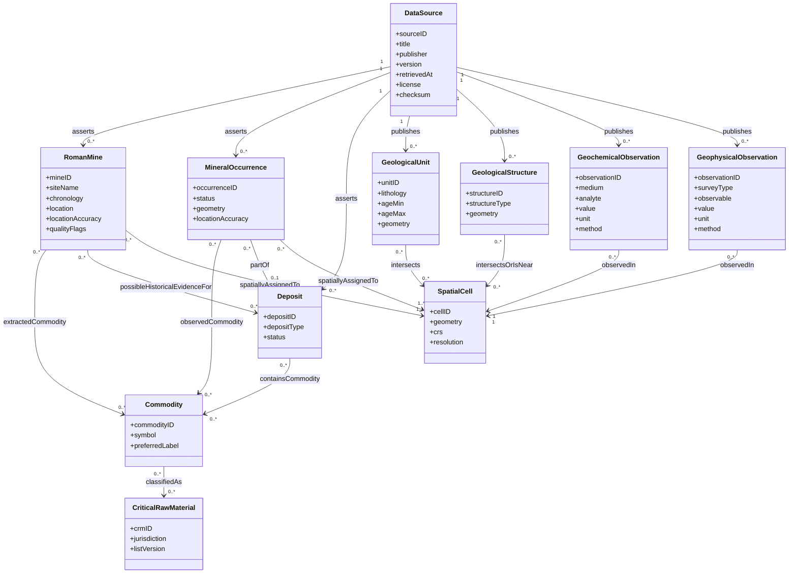

# Ontología conceptual mínima

## Alcance

Este esquema conecta evidencia arqueológica, ocurrencias modernas, geología, observaciones y celdas sin convertir cada campo en una clase. No afirma equivalencia entre mina romana y depósito moderno. Los identificadores locales permanecen vinculados a `DataSource` y cada relación espacial debe registrar método, escala e incertidumbre.

## Semántica de relaciones clave

- `RomanMine extractedCommodity Commodity`: commodity registrada como explotada; puede ser desconocida o incompleta. No implica recurso moderno económico.
- `RomanMine possibleHistoricalEvidenceFor Deposit`: relación hipotética/probabilística que requiere procedencia y confianza. Nunca se crea solo por proximidad.
- `MineralOccurrence partOf Deposit`: una ocurrencia puede no estar asignada a un depósito; no fusionar automáticamente puntos próximos.
- `Commodity classifiedAs CriticalRawMaterial`: clasificación temporal y jurisdiccional, reificada mediante lista/versión. “Crítica” no es una propiedad eterna del elemento.
- `spatiallyAssignedTo`: debe guardar regla de intersección/buffer, distancia, CRS, resolución y efecto de incertidumbre. Un punto impreciso puede asignarse probabilísticamente a varias celdas.
- `asserts/publishes`: toda entidad u observación debe llevar fuente, versión y checksum; los valores transformados se vinculan además a una actividad de derivación en la implementación.

## Restricciones mínimas

1. `mineID` es único solo dentro de la fuente/versión OxREP; usar un identificador global compuesto.
2. Una observación geoquímica necesita analito, valor/censura, unidad, medio y método; no mezclar campañas sin metadatos.
3. Una observación geofísica necesita observable, unidad, campaña/procesamiento y geometría/huella.
4. `SpatialCell` debe pertenecer a una malla versionada; el mismo `cellID` no se reutiliza entre resoluciones.
5. La ausencia de relación no expresa una relación negativa.
6. Los flags de calidad son anotaciones de datos, no clases geológicas.

## Mapeo inicial de OxREP

| OxREP | Ontología | Nota |
|---|---|---|
| `mineID`, `site`, coordenadas, cronología | `RomanMine` | Conservar valor crudo, precisión y trazabilidad de fila. |
| campos `metalMined*` | relación a `Commodity` | Estados presente/ausente/desconocido/no informado separados. |
| `geology`, `depositType`, `exploitationType` | atributos fuente de `RomanMine` | No promover automáticamente a `GeologicalUnit` o `Deposit`; son heterogéneos y parciales. |
| `references`, `locationDataSource` | `DataSource`/citas | Requieren normalización bibliográfica posterior. |
| técnicas | atributo o vocabulario controlado de actividad minera | Fuera del núcleo solicitado, puede modular observación/preservación. |

## Qué se aplaza

No se introducen todavía clases extensas de procesos mineralizantes, alteraciones, recursos/reservas, actividades PROV-O, personas/organizaciones ni una taxonomía completa de depósitos. Se añadirán solo cuando los datasets externos aporten campos reales y casos de uso que lo justifiquen.

